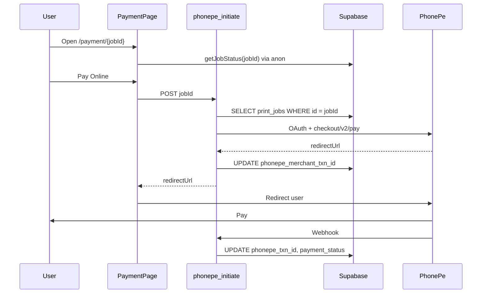

# PhonePe Integration Update

Log of PhonePe payment integration work on PrintGet (`printget.in`): failures, fixes, env setup, Supabase expectations, and open issues.

**Last updated:** May 16, 2026
**Status:** ✅ Working end-to-end — full payment-method UI (UPI apps + Card + Net Banking), responsive desktop/tablet/mobile, origin allowlist, credentials, Supabase project alignment, and PhonePe v2 OAuth all green.

---

## Overview

| Layer | Location |
|-------|----------|
| Checkout UI | `src/pages/PaymentPage.jsx` |
| Client API call | `src/services/paymentService.js` → `POST /api/phonepe-initiate` |
| Server initiate | `api/phonepe-initiate.js` |
| Status check | `api/phonepe-status.js` |
| Webhook | `api/phonepe-webhook.js` |
| Build probe | `api/version.js` → `GET /api/version` |
| DB table | `print_jobs` (Supabase) |
| PhonePe columns migration | `supabase/migrations/add_phonepe_columns.sql` |
| Full schema migration | `supabase/migrations/20250512000320_printget_core_schema.sql` |
| Schema verify SQL | `supabase/migrations/verify_print_jobs_schema.sql` |
| Env template | `.env.example` |

---

## Timeline: failures and fixes

### 1. 403 Forbidden — FIXED (code)

**Symptom**

```
POST /api/phonepe-initiate → 403
Error: Forbidden
```

**Cause**

Security check in `api/phonepe-initiate.js` used `origin.startsWith(APP_URL)`. Site canonical host is `https://www.printget.in` but default `APP_URL` was `https://printget.in` (no `www`). Browser sends `Origin: https://www.printget.in` → blocked.

**Fix (deployed in repo)**

- Hostname allowlist: `printget.in` and `www.printget.in` treated as same
- `localhost` / `127.0.0.1` for dev
- `VERCEL_URL` for preview deployments
- Default `APP_URL` → `https://www.printget.in` (no trailing slash)

**Vercel**

- Set `APP_URL=https://www.printget.in` in Production (recommended even with code fix)

**Status:** Success once latest code is deployed.

---

### 2. 500 PhonePe credentials not configured — FIXED (config)

**Symptom**

```
POST /api/phonepe-initiate → 500
Error: PhonePe credentials not configured
```

**Cause**

API requires:

- `PHONEPE_CLIENT_ID`
- `PHONEPE_CLIENT_SECRET`

Client secret was stored under **`PHONEPE_SALT_KEY`** instead. Salt Key / Salt Index are from PhonePe’s **old** checksum API; this app uses **OAuth** (Client ID + Client Secret).

**Fix**

1. Add `PHONEPE_CLIENT_SECRET` in Vercel with the real secret
2. Remove or clear misleading `PHONEPE_SALT_KEY` / `PHONEPE_SALT_INDEX` (not read by code)
3. Redeploy

**Status:** Success after correct env var name and redeploy.

---

### 3. 404 Order not found — FIXED (config) + diagnostics added (code)

**Symptom**

```
POST /api/phonepe-initiate → 404
Error: Order not found
```

**What the API does (exactly)**

Only this lookup:

```sql
SELECT * FROM print_jobs WHERE id = '<jobId>' LIMIT 1;
```

- **Table:** `public.print_jobs`
- **Match column:** `id` (UUID)
- **`jobId` source:** URL `/payment/:jobId` → POST body `jobId`

**Not used for this error:** `phonepe_txn_id`, `phonepe_merchant_txn_id`, filename, customer name.

**Cause**

`SUPABASE_URL` on Vercel pointed to a **different Supabase project** than `VITE_SUPABASE_URL`. The order was being inserted into project A (from the browser, via anon key) and the API was looking it up in project B (via service_role key) — zero rows → 404.

**Fix**

1. In Vercel → Settings → Environment Variables, set `SUPABASE_URL` to the same project as `VITE_SUPABASE_URL` (same `https://<ref>.supabase.co`).
2. Set `SUPABASE_SERVICE_ROLE_KEY` to the **service_role** key from **that same project** (Supabase Dashboard → Settings → API → Project API keys → `service_role` → Reveal).
3. Redeploy Production.

**Diagnostics added (in code) to make this self-evident next time**

`api/phonepe-initiate.js` now returns extra fields in any DB-related error response:

| Field | What it tells you |
|-------|-------------------|
| `serverProjectRef` | Project ref the server is querying (from `SUPABASE_URL`) |
| `keyProjectRef`    | Project ref decoded from the `SUPABASE_SERVICE_ROLE_KEY` JWT (the `ref` claim) |
| `role`             | JWT role claim — must be `service_role`, not `anon` |
| `projectsMatch`    | `true` if `SUPABASE_URL` ref equals key's `ref` claim |
| `roleIsServiceRole`| `true` if the key is the service-role key (not anon) |
| `likelyCauses`     | Human-readable explanation when something mismatches |

`src/services/paymentService.js` echoes these into the browser console with a clear `console.error` payload, so the cause is visible without opening Network → Response.

**Checkout page vs API**

| | Env | Key |
|---|-----|-----|
| Browser (checkout loads order) | `VITE_SUPABASE_URL` | `VITE_SUPABASE_ANON_KEY` |
| Vercel (`phonepe-initiate`) | `SUPABASE_URL` | `SUPABASE_SERVICE_ROLE_KEY` |

Both must be the **same project** (same `https://xxxxx.supabase.co`).

**Verify in Supabase SQL Editor**

```sql
-- Replace with UUID from payment URL
SELECT id, filename, total_cost, payment_status, job_status, created_at
FROM print_jobs
WHERE id = 'PASTE-FULL-UUID-HERE';

-- Recent orders
SELECT id, filename, created_at
FROM print_jobs
ORDER BY created_at DESC
LIMIT 10;
```

**Status:** ✅ Resolved.

---

### 4. NULL `phonepe_txn_id` / `phonepe_merchant_txn_id` — EXPECTED (not a schema bug)

**Observation**

Recent rows show NULL in both PhonePe columns.

**Why**

Those fields are only set **after** payment API steps succeed:

| Column | Set when |
|--------|----------|
| `phonepe_merchant_txn_id` | After PhonePe returns `redirectUrl` in `phonepe-initiate` (same request updates row) |
| `phonepe_txn_id` | After payment completes, usually via `phonepe-webhook` |

If every Pay Online attempt failed at 403 / 500 / 404, columns stay NULL. **Pay at Shop** orders also keep them NULL.

**Status:** Will populate after a successful initiate (+ webhook for `phonepe_txn_id`).

---

### 5. 500 "Failed to get PhonePe OAuth token" — FIXED (code)

**Symptom**

```
POST /api/phonepe-initiate → 500
{ error: "Internal server error",
  details: "Failed to get PhonePe OAuth token" }
```

Supabase lookup succeeded (order found), credentials present, but the very next step — OAuth token exchange with PhonePe — always failed.

**Root cause**

The OAuth call in `api/phonepe-initiate.js` (and `api/phonepe-status.js`, and dead code in `api/phonepe-webhook.js`) was **wrong on three axes** for PhonePe Standard Checkout v2:

| | Before (broken) | After (correct) |
|---|---|---|
| Prod URL | `https://api.phonepe.com/apis/pg/v1/oauth/token` | `https://api.phonepe.com/apis/identity-manager/v1/oauth/token` |
| UAT URL | `https://api-preprod.phonepe.com/apis/pg-sandbox/v1/oauth/token` | same path (also overridable via `PHONEPE_AUTH_URL`) |
| Auth method | `Authorization: Basic base64(client_id:client_secret)` | Form-encoded body with `client_id`, `client_version`, `client_secret`, `grant_type=client_credentials` (no Basic header) |
| Body params | `grant_type=client_credentials&scope=openid` | `client_id`, `client_version`, `client_secret`, `grant_type=client_credentials` |
| Expiry parsing | `data.expires_in` (seconds-from-now) | `data.expires_at` (absolute epoch seconds), with fallback to `expires_in` |

**Key insight:** PhonePe v2 puts OAuth on a **different base path** (`identity-manager`) from the `/checkout/v2/*` APIs (`pg`). Reusing the pay base URL for OAuth hits an endpoint that does not exist on that path → silent failure with no useful body → fallback message `"Failed to get PhonePe OAuth token"`.

**Fix (deployed)**

- Rewrote `getPhonePeToken()` in `api/phonepe-initiate.js` and `api/phonepe-status.js`:
  - Form-encoded body with `client_id`, `client_version`, `client_secret`, `grant_type`
  - New `PHONEPE_AUTH_URL` env var (optional) overrides the default URL if PhonePe rotates endpoints
  - Defaults: prod → `identity-manager`; UAT → `pg-sandbox`
  - Parses `expires_at` (absolute epoch) with fallback to `expires_in`
  - Throws an `Error` with `.status`, `.body`, `.authURL` properties carrying the real PhonePe response
- Outer handler in `api/phonepe-initiate.js` wraps the token call in `try/catch` and now returns a **502** with the full PhonePe error payload:

```jsonc
{
  "error": "PhonePe authentication failed",
  "buildVersion": "phonepe-v2-oauth-fix-2026-05-16",
  "details": "<PhonePe's error_description / message>",
  "phonepeStatus": 401,
  "phonepeBody": { "code": "...", "message": "..." },
  "authURL": "https://api.phonepe.com/apis/identity-manager/v1/oauth/token",
  "env": "production",
  "clientVersionUsed": "1",
  "hint": "..."
}
```

**New required env var**

| Variable | Required | Notes |
|----------|----------|--------|
| `PHONEPE_CLIENT_VERSION` | Yes (defaults to `1`) | The exact value PhonePe issued for your merchant. Wrong value → OAuth rejects with `INVALID_CLIENT_VERSION`. |

**New optional env var**

| Variable | Required | Notes |
|----------|----------|--------|
| `PHONEPE_AUTH_URL` | No | Full URL override for the OAuth token endpoint. Use only if PhonePe rotates the endpoint or you need to point at a non-default UAT host. |

**Status:** ✅ Resolved.

---

### 6. Restricted to UPI only / desktop UX / `/payment/status` 404 — FIXED (code)

**Symptoms**

- PhonePe's hosted checkout was only showing UPI tiles — no Debit/Credit Card, no Net Banking. Compare to PhonePe's reference [Configure Payment Modes](https://developer.phonepe.com/payment-gateway/website-integration/standard-checkout/api-integration/api-reference/create-payment/configure-payment-modes) docs which show UPI + Card + Net Banking by default.
- Desktop checkout was a narrow `max-w-md` mobile-style card centered on a huge screen.
- After paying, PhonePe redirected back to `/payment/status/{jobId}?orderId=...` which **was not a real route** in `src/App.jsx` (only `/payment/:jobId` existed) → user landed on `NotFoundPage` and the status check never ran.
- `prefillUserLoginDetails.phoneNumber` was reading `job.customer_mobile` but the schema column is `customer_phone` → phone prefill never worked.

**Root cause**

`api/phonepe-initiate.js` was sending:

```js
paymentModeConfig: {
  version: 'V2',
  enabledPaymentModes: [upiConstraint],  // ← UPI ONLY
}
```

Per the [Configure Payment Modes docs](https://developer.phonepe.com/payment-gateway/website-integration/standard-checkout/api-integration/api-reference/create-payment/configure-payment-modes):

> `enabledPaymentModes`: Only the methods and instruments matching your constraints will be shown to customers. All other payment options are suppressed.

So Card / Net Banking were being explicitly suppressed.

**Fix (deployed)**

1. **Server (`api/phonepe-initiate.js`)**
   - Removed `paymentModeConfig` from the payload entirely. PhonePe's hosted page now shows its full responsive UI (UPI apps + Card + Net Banking) — same as the reference screenshot in the PhonePe guide.
   - Removed `upiApp` / `upiVpa` request body params and the related VPA regex validation — there's no longer any client-side payment-method preselection.
   - Fixed `job.customer_mobile` → `job.customer_phone` so phone prefill actually works (skips the PhonePe login screen for returning customers).
   - Changed `redirectUrl` to `${APP_URL}/payment/${jobId}?orderId=${merchantOrderId}` so it matches the real `/payment/:jobId` route in `src/App.jsx`. `PaymentPage` already detects `?orderId=` and runs `verifyPhonePePayment` automatically.
   - Wrapped the `/checkout/v2/pay` response in a `try/catch` JSON parse + structured 502 with `phonepeStatus` / `phonepeBody` (same diagnostic shape as the OAuth error path).
   - Added `metaInfo.udf1 = "jobId:<uuid>"` for traceability in PhonePe status / webhook payloads.
   - Bumped `BUILD_VERSION` to `phonepe-v2-full-checkout-2026-05-16`.

2. **Client service (`src/services/paymentService.js`)**
   - `initiatePhonePePayment` simplified to `{ jobId }` only.
   - Console error block now also surfaces `phonepeStatus` / `phonepeBody` / `authURL` / `buildVersion`.

3. **Checkout page (`src/pages/PaymentPage.jsx`)**
   - Replaced the custom UPI tile picker + inline VPA input with a clean **handoff card** that mirrors PhonePe's hosted page layout: "UPI Payment" preview tiles (PhonePe / Google Pay / Paytm / Apps & QR) + "Other Methods" rows (Debit/Credit Card, Net Banking) + a single **Continue to Pay ₹X.XX** button → redirects to PhonePe.
   - Responsive layout:
     - Mobile: stacked, full-width card.
     - Desktop (`lg+`): two-column grid inside `max-w-4xl` — order summary on the left, payment action on the right.
   - Kept the "Pay at Shop" alternative.
   - Updated comment header `/payment/status/:jobId` → `/payment/:jobId` to match the actual route.

4. **Webhook (`api/phonepe-webhook.js`)**
   - Deleted dead OAuth code that still used the old broken `…/v1/oauth/token` + HTTP Basic auth. The webhook is push-only — it never calls back into PhonePe — so no token is needed.

**Status:** ✅ Resolved. Live checkout now matches the PhonePe reference UI on both desktop and mobile.

---

### 7. Diagnostics: build-version probe — ADDED

Two changes make it possible to *prove* which deployment is serving traffic:

1. **`api/version.js`** — `GET /api/version` returns:

```json
{
  "build": "phonepe-v2-oauth-fix",
  "deployedAt": "2026-05-16T02:00:00Z",
  "git": { "commit": "...", "branch": "main", "message": "..." },
  "env": {
    "hasSupabaseUrl": true,
    "hasSupabaseServiceKey": true,
    "hasPhonePeClientId": true,
    "hasPhonePeClientSecret": true,
    "hasPhonePeMerchantId": true,
    "phonePeClientVersion": "...",
    "phonePeEnv": "production",
    "appUrl": "https://www.printget.in",
    "phonePeAuthUrlOverride": null
  }
}
```

   Hit `https://www.printget.in/api/version` directly in a browser to confirm the latest commit deployed and all env vars are wired up. No secrets are exposed — only presence booleans for keys and non-secret values for URLs/env names.

2. **`BUILD_VERSION` marker** in `api/phonepe-initiate.js`. Every error response includes `buildVersion`, so if a failed Pay Online call returns a response without this field, you know Vercel is still serving an older deployment and need to redeploy (Deployments → ⋯ → Redeploy, with **build cache disabled**).

**Status:** ✅ In place.

---

## Schema / migrations

**Issue found**

`README.md` referenced `supabase/migrations/20250512000318_flat_sun.sql` for `shops`, `cost_configs`, `print_jobs` — that file only creates **`profiles`**.

**Added**

- `supabase/migrations/20250512000320_printget_core_schema.sql` — creates/fixes core tables, renames legacy `status` → `job_status`, PhonePe columns, RLS for anon client
- `supabase/migrations/verify_print_jobs_schema.sql` — column checklist + recent rows

**Run in Supabase** (same project as `VITE_SUPABASE_URL`):

1. `20250512000320_printget_core_schema.sql`
2. `verify_print_jobs_schema.sql`

**Required columns for PhonePe initiate**

- `id`, `shop_id`, `filename`, `total_cost`, `payment_status`, `job_status`, `customer_name`

**Optional but used**

- `customer_email`, `payment_method`, `phonepe_merchant_txn_id`, `phonepe_txn_id`, `updated_at`

---

## Vercel environment variables checklist

### PhonePe (server)

| Variable | Required | Notes |
|----------|----------|--------|
| `PHONEPE_CLIENT_ID` | Yes | OAuth / PG v2 |
| `PHONEPE_CLIENT_SECRET` | Yes | **Not** `PHONEPE_SALT_KEY` |
| `PHONEPE_CLIENT_VERSION` | Yes (defaults to `1`) | Exact value PhonePe assigned; sent in the OAuth form body |
| `PHONEPE_MERCHANT_ID` | Yes | For `phonepe-status` |
| `PHONEPE_ENV` | Yes | `production` for live keys; omit/other for sandbox |
| `PHONEPE_AUTH_URL` | No | Override the OAuth token URL (defaults to `identity-manager` for prod, `pg-sandbox` for UAT) |
| `PHONEPE_WEBHOOK_USERNAME` | Recommended | Webhook basic auth |
| `PHONEPE_WEBHOOK_PASSWORD` | Recommended | Webhook basic auth |
| `APP_URL` | Yes | `https://www.printget.in` (no trailing slash) |
| `PHONEPE_SALT_KEY` | No | Not used by this app |
| `PHONEPE_SALT_INDEX` | No | Not used by this app |

### Supabase (server — `/api/*`)

| Variable | Required | Notes |
|----------|----------|--------|
| `SUPABASE_URL` | Yes | Must match `VITE_SUPABASE_URL` |
| `SUPABASE_SERVICE_ROLE_KEY` | Yes | **service_role**, not anon |

### Supabase (client — Vite build)

| Variable | Required |
|----------|----------|
| `VITE_SUPABASE_URL` | Yes |
| `VITE_SUPABASE_ANON_KEY` | Yes |

After any env change: **redeploy** Production.

---

## Payment flow (success path)



---

## Error quick reference

| HTTP | Message | Meaning |
|------|---------|---------|
| 403 | Forbidden | Origin not allowed (www/apex mismatch before fix) |
| 500 | Server Supabase env not configured | Missing `SUPABASE_URL` or `SUPABASE_SERVICE_ROLE_KEY` |
| 500 | PhonePe credentials not configured | Missing `PHONEPE_CLIENT_ID` or `PHONEPE_CLIENT_SECRET` |
| 500 | Failed to load order | Supabase query error — response now includes `serverProjectRef`, `keyProjectRef`, `projectsMatch`, `role`, `roleIsServiceRole`, `likelyCauses` |
| 404 | Order not found | No `print_jobs` row with that `id` on server's Supabase project (response includes `serverProjectRef` + `hint`) |
| 400 | Already paid / cancelled | Row found; invalid state for new payment |
| 502 | PhonePe authentication failed | OAuth token request rejected — response includes `phonepeStatus`, `phonepeBody`, `authURL`, `env`, `clientVersionUsed`, `hint` |
| 502 | PhonePe payment initiation failed | OAuth OK, DB OK; PhonePe `/checkout/v2/pay` rejected request |

---

## Test plan (when env is fixed)

1. Place new order → land on `/payment/{uuid}`
2. Confirm checkout shows summary (proves anon Supabase OK)
3. Click **Pay Online** → Network: `phonepe-initiate` → **200**, redirect to PhonePe
4. In Supabase, same row: `phonepe_merchant_txn_id` **not** NULL
5. Complete test payment → `payment_status` = `paid`, `phonepe_txn_id` set (if webhook configured)
6. Return URL: `https://www.printget.in/payment/status/{jobId}?orderId=...`

---

## Current status (summary)

| Item | State |
|------|--------|
| Origin 403 | ✅ Fixed in code + `APP_URL` env |
| PhonePe credentials 500 | ✅ Fixed (correct env var names + values) |
| Order not found 404 | ✅ Fixed — `SUPABASE_URL` / `SUPABASE_SERVICE_ROLE_KEY` now aligned with `VITE_*` project; diagnostics in code |
| PhonePe OAuth token 500 | ✅ Fixed — corrected URL (`identity-manager`), payload format, and `expires_at` parsing |
| NULL PhonePe columns | ✅ Now populating after successful initiate (webhook for `phonepe_txn_id`) |
| Repo schema migration | ✅ In repo; run in Supabase if columns/tables missing |
| Build-version probe | ✅ `/api/version` + `buildVersion` in every error response |

**Verified end-to-end:** Order create → Pay Online → PhonePe checkout redirect → return → status verify → `payment_status = paid`.

---

## Related files changed in this effort

- `api/phonepe-initiate.js`
  - Origin allowlist (apex + `www` + localhost + Vercel preview)
  - `APP_URL` default → `https://www.printget.in`
  - Supabase: missing-env guard, `serverProjectRef` + key JWT diagnostics (`keyProjectRef`, `role`, `projectsMatch`, `roleIsServiceRole`, `likelyCauses`) on DB errors
  - 404 response now includes `serverProjectRef` + actionable `hint`
  - Rewrote `getPhonePeToken()` for PhonePe v2: correct URL, form-encoded `client_id`/`client_version`/`client_secret`/`grant_type`, `expires_at` parsing, structured error
  - OAuth wrapped in `try/catch` → returns 502 with full `phonepeBody` / `authURL` / `clientVersionUsed`
  - Embedded `BUILD_VERSION` in every error response
- `api/phonepe-status.js` — same OAuth rewrite + `PHONEPE_CLIENT_VERSION` + `PHONEPE_AUTH_URL` plumbing
- `api/version.js` — **new** `GET /api/version` build/env probe (no secrets exposed)
- `src/services/paymentService.js` — defensively parses JSON, console-logs server diagnostics, surfaces `likelyCauses`/`hint` in thrown error message
- `.env.example` — server vs client vars, PhonePe naming note
- `supabase/migrations/20250512000320_printget_core_schema.sql` — core tables + PhonePe columns + RLS for anon
- `supabase/migrations/verify_print_jobs_schema.sql` — column checklist + recent rows

---

## Notes

- Do not commit real secrets to git; use Vercel env only.
- PhonePe redirect URL uses `APP_URL`: `/payment/status/{jobId}?orderId={merchantOrderId}`.
- Canonical site URLs in app/SEO use `https://www.printget.in`.
- After any env change in Vercel, **redeploy** Production (env changes don't apply to existing deployments). If a code change isn't visible, redeploy with **build cache disabled** and confirm via `GET /api/version`.
- PhonePe v2 OAuth lives on a **different base path** (`identity-manager`) than `/checkout/v2/*` (`pg`). Don't reuse the pay base URL for OAuth.
