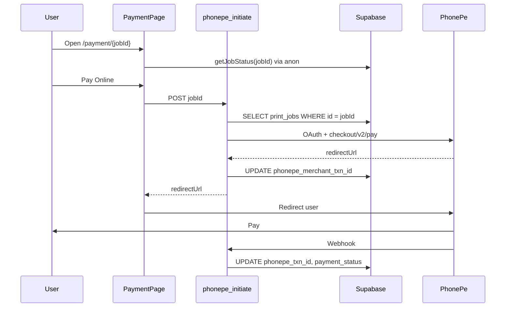

# PhonePe Integration Update

Log of PhonePe payment integration work on PrintGet (`printget.in`): failures, fixes, env setup, Supabase expectations, and open issues.

**Last updated:** May 2026

---

## Overview

| Layer | Location |
|-------|----------|
| Checkout UI | `src/pages/PaymentPage.jsx` |
| Client API call | `src/services/paymentService.js` → `POST /api/phonepe-initiate` |
| Server initiate | `api/phonepe-initiate.js` |
| Status check | `api/phonepe-status.js` |
| Webhook | `api/phonepe-webhook.js` |
| DB table | `print_jobs` (Supabase) |
| PhonePe columns migration | `supabase/migrations/add_phonepe_columns.sql` |
| Full schema migration | `supabase/migrations/20250512000320_printget_core_schema.sql` |
| Schema verify SQL | `supabase/migrations/verify_print_jobs_schema.sql` |
| Env template | `.env.example` |

---

## Timeline: failures and fixes

### 1. 403 Forbidden — FIXED (code)

**Symptom**

```
POST /api/phonepe-initiate → 403
Error: Forbidden
```

**Cause**

Security check in `api/phonepe-initiate.js` used `origin.startsWith(APP_URL)`. Site canonical host is `https://www.printget.in` but default `APP_URL` was `https://printget.in` (no `www`). Browser sends `Origin: https://www.printget.in` → blocked.

**Fix (deployed in repo)**

- Hostname allowlist: `printget.in` and `www.printget.in` treated as same
- `localhost` / `127.0.0.1` for dev
- `VERCEL_URL` for preview deployments
- Default `APP_URL` → `https://www.printget.in` (no trailing slash)

**Vercel**

- Set `APP_URL=https://www.printget.in` in Production (recommended even with code fix)

**Status:** Success once latest code is deployed.

---

### 2. 500 PhonePe credentials not configured — FIXED (config)

**Symptom**

```
POST /api/phonepe-initiate → 500
Error: PhonePe credentials not configured
```

**Cause**

API requires:

- `PHONEPE_CLIENT_ID`
- `PHONEPE_CLIENT_SECRET`

Client secret was stored under **`PHONEPE_SALT_KEY`** instead. Salt Key / Salt Index are from PhonePe’s **old** checksum API; this app uses **OAuth** (Client ID + Client Secret).

**Fix**

1. Add `PHONEPE_CLIENT_SECRET` in Vercel with the real secret
2. Remove or clear misleading `PHONEPE_SALT_KEY` / `PHONEPE_SALT_INDEX` (not read by code)
3. Redeploy

**Status:** Success after correct env var name and redeploy.

---

### 3. 404 Order not found — CURRENT PROBLEM

**Symptom**

```
POST /api/phonepe-initiate → 404
Error: Order not found
```

**What the API does (exactly)**

Only this lookup:

```sql
SELECT * FROM print_jobs WHERE id = '<jobId>' LIMIT 1;
```

- **Table:** `public.print_jobs`
- **Match column:** `id` (UUID)
- **`jobId` source:** URL `/payment/:jobId` → POST body `jobId`

**Not used for this error:** `phonepe_txn_id`, `phonepe_merchant_txn_id`, filename, customer name.

**When 404 is returned**

Query returns **zero rows** using server env:

- `SUPABASE_URL`
- `SUPABASE_SERVICE_ROLE_KEY`

**When 500 is returned instead** (after code update)

Supabase query error (e.g. missing column, bad key format) → `Failed to load order` + `details`.

**Most likely causes**

1. **`SUPABASE_URL` ≠ `VITE_SUPABASE_URL`** (different Supabase projects)
2. **`SUPABASE_SERVICE_ROLE_KEY`** is anon key or from another project
3. **UUID in URL** does not exist in the project you’re viewing in dashboard
4. Less common: row never inserted (order flow failed before save)

**Checkout page vs API**

| | Env | Key |
|---|-----|-----|
| Browser (checkout loads order) | `VITE_SUPABASE_URL` | `VITE_SUPABASE_ANON_KEY` |
| Vercel (`phonepe-initiate`) | `SUPABASE_URL` | `SUPABASE_SERVICE_ROLE_KEY` |

Both must be the **same project** (same `https://xxxxx.supabase.co`).

**Verify in Supabase SQL Editor**

```sql
-- Replace with UUID from payment URL
SELECT id, filename, total_cost, payment_status, job_status, created_at
FROM print_jobs
WHERE id = 'PASTE-FULL-UUID-HERE';

-- Recent orders
SELECT id, filename, created_at
FROM print_jobs
ORDER BY created_at DESC
LIMIT 10;
```

**Status:** Open until server Supabase env matches frontend project and redeploy is confirmed.

---

### 4. NULL `phonepe_txn_id` / `phonepe_merchant_txn_id` — EXPECTED (not a schema bug)

**Observation**

Recent rows show NULL in both PhonePe columns.

**Why**

Those fields are only set **after** payment API steps succeed:

| Column | Set when |
|--------|----------|
| `phonepe_merchant_txn_id` | After PhonePe returns `redirectUrl` in `phonepe-initiate` (same request updates row) |
| `phonepe_txn_id` | After payment completes, usually via `phonepe-webhook` |

If every Pay Online attempt failed at 403 / 500 / 404, columns stay NULL. **Pay at Shop** orders also keep them NULL.

**Status:** Will populate after a successful initiate (+ webhook for `phonepe_txn_id`).

---

## Schema / migrations

**Issue found**

`README.md` referenced `supabase/migrations/20250512000318_flat_sun.sql` for `shops`, `cost_configs`, `print_jobs` — that file only creates **`profiles`**.

**Added**

- `supabase/migrations/20250512000320_printget_core_schema.sql` — creates/fixes core tables, renames legacy `status` → `job_status`, PhonePe columns, RLS for anon client
- `supabase/migrations/verify_print_jobs_schema.sql` — column checklist + recent rows

**Run in Supabase** (same project as `VITE_SUPABASE_URL`):

1. `20250512000320_printget_core_schema.sql`
2. `verify_print_jobs_schema.sql`

**Required columns for PhonePe initiate**

- `id`, `shop_id`, `filename`, `total_cost`, `payment_status`, `job_status`, `customer_name`

**Optional but used**

- `customer_email`, `payment_method`, `phonepe_merchant_txn_id`, `phonepe_txn_id`, `updated_at`

---

## Vercel environment variables checklist

### PhonePe (server)

| Variable | Required | Notes |
|----------|----------|--------|
| `PHONEPE_CLIENT_ID` | Yes | OAuth / PG v2 |
| `PHONEPE_CLIENT_SECRET` | Yes | **Not** `PHONEPE_SALT_KEY` |
| `PHONEPE_MERCHANT_ID` | Yes | For `phonepe-status` |
| `PHONEPE_ENV` | Yes | `production` for live keys; omit/other for sandbox |
| `PHONEPE_WEBHOOK_USERNAME` | Recommended | Webhook basic auth |
| `PHONEPE_WEBHOOK_PASSWORD` | Recommended | Webhook basic auth |
| `APP_URL` | Yes | `https://www.printget.in` (no trailing slash) |
| `PHONEPE_SALT_KEY` | No | Not used by this app |
| `PHONEPE_SALT_INDEX` | No | Not used by this app |

### Supabase (server — `/api/*`)

| Variable | Required | Notes |
|----------|----------|--------|
| `SUPABASE_URL` | Yes | Must match `VITE_SUPABASE_URL` |
| `SUPABASE_SERVICE_ROLE_KEY` | Yes | **service_role**, not anon |

### Supabase (client — Vite build)

| Variable | Required |
|----------|----------|
| `VITE_SUPABASE_URL` | Yes |
| `VITE_SUPABASE_ANON_KEY` | Yes |

After any env change: **redeploy** Production.

---

## Payment flow (success path)



---

## Error quick reference

| HTTP | Message | Meaning |
|------|---------|---------|
| 403 | Forbidden | Origin not allowed (www/apex mismatch before fix) |
| 500 | PhonePe credentials not configured | Missing `PHONEPE_CLIENT_ID` or `PHONEPE_CLIENT_SECRET` |
| 500 | Failed to load order | Supabase query error (check `details`, schema, key) |
| 404 | Order not found | No `print_jobs` row with that `id` on server’s Supabase project |
| 400 | Already paid / cancelled | Row found; invalid state for new payment |
| 502 | PhonePe payment initiation failed | Credentials OK, DB OK; PhonePe API rejected request |

---

## Test plan (when env is fixed)

1. Place new order → land on `/payment/{uuid}`
2. Confirm checkout shows summary (proves anon Supabase OK)
3. Click **Pay Online** → Network: `phonepe-initiate` → **200**, redirect to PhonePe
4. In Supabase, same row: `phonepe_merchant_txn_id` **not** NULL
5. Complete test payment → `payment_status` = `paid`, `phonepe_txn_id` set (if webhook configured)
6. Return URL: `https://www.printget.in/payment/status/{jobId}?orderId=...`

---

## Current problem (summary)

| Item | State |
|------|--------|
| Origin 403 | Fixed in code; deploy + `APP_URL` |
| PhonePe credentials 500 | Fixed if `PHONEPE_CLIENT_SECRET` set correctly |
| Order not found 404 | **Open** — align `SUPABASE_URL` + `SUPABASE_SERVICE_ROLE_KEY` with `VITE_*` project; verify UUID in SQL |
| NULL PhonePe columns | **Expected** until a payment initiate succeeds |
| Repo schema migration | Added; run in Supabase if columns/tables missing |

**Next action:** In Supabase (project matching `VITE_SUPABASE_URL`), run verify SQL with payment URL UUID. If row exists, fix Vercel server Supabase vars to that exact project and redeploy. Retry Pay Online on a **new** order.

---

## Related files changed in this effort

- `api/phonepe-initiate.js` — origin check, `APP_URL` default, `select('*')`, clearer 404/500, `job_status` / `status`
- `.env.example` — server vs client vars, PhonePe naming note
- `supabase/migrations/20250512000320_printget_core_schema.sql` — new
- `supabase/migrations/verify_print_jobs_schema.sql` — new

---

## Notes

- Do not commit real secrets to git; use Vercel env only.
- PhonePe redirect URL uses `APP_URL`: `/payment/status/{jobId}?orderId={merchantOrderId}`.
- Canonical site URLs in app/SEO use `https://www.printget.in`.
